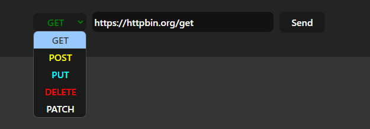
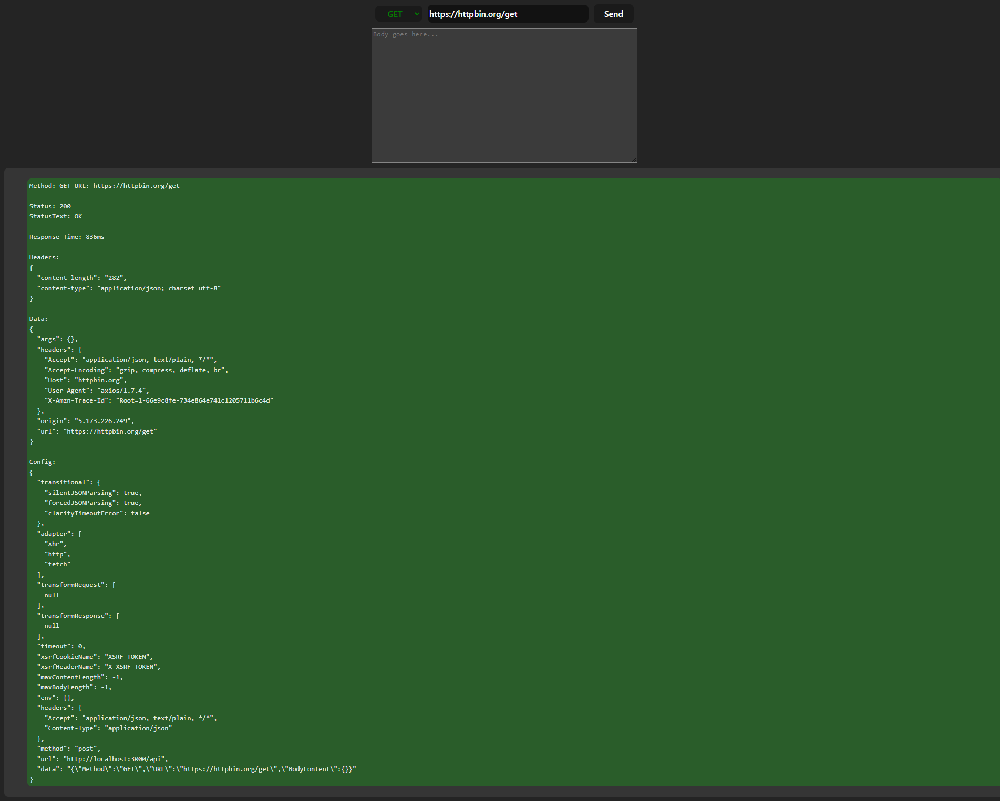

# EndpointTester
# The application is currently in development!

## Introduction

A simple web tool designed to send HTTP requests to specific endpoints using various HTTP methods. The project provides an interface for users to:

- Select the request method (e.g., GET, POST, PUT, DELETE, PATCH).
- Specify the URL where the request will be sent.
- Enter the body content for the request (if applicable).

The tool is built with a React frontend and an Express backend, both written in TypeScript. It uses Axios for making HTTP requests and includes features such as request history logging and response display.

## Pictures

